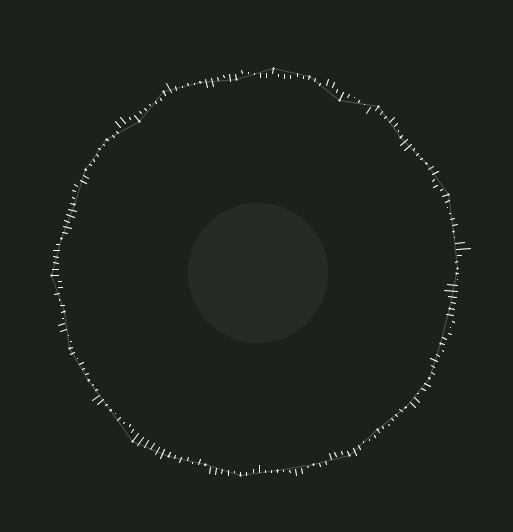

# `Minim`
Processingのオーディオライブラリ。

# オーディオに関する基礎知識
ライブラリの利用や、ドキュメントを理解するために必要なオーディオに関する基礎知識に関して。

## バッファ（buffer）
バッファ（buffer）とはデータを一時的に貯めておくデータ領域のこと。

主に先読みしたデータを貯める。

### 何故、先読みしたデータを貯めるのか
データ送信が途切れた際でも、連続するデータの流れが途切れない（動画や音楽の再生が途中で止まらない）ようにするため。

### バッファの利用例
バッファは様々なサービスやシーンで利用されている。例としてYoutubeを挙げてみる。

再生位置の右側の、薄いグレーの線がバッファである。

バッファ内の再生位置に移動しても、すぐに動画が再生される。これは上記の通り先読みしたデータが貯められているからである。

逆にバッファ外の再生位置に移動したり、バッファがない状態で再生をしていると動画が途中で止まったり、読み込みに時間がかかることがある。こういった状況を極力防ぐためにバッファが利用されている。

## バッファサイズ
バッファ（データを一時的に貯めておくデータ領域）のサイズのこと。

## サンプル
>離散信号（英: Discrete signal）もしくは離散時間信号（英: Discrete-time signal）は、連続信号を標本化した信号の時系列である。連続信号とは違い、離散信号は連続信号の関数ではないが量の系列である、つまり離散的な整数の範囲の関数である。これらの系列の値を「標本値（sample）」という。

[離散信号](https://ja.wikipedia.org/wiki/%E9%9B%A2%E6%95%A3%E4%BF%A1%E5%8F%B7)

>A sample is a value or set of values at a point in time and/or space.（サンプルとは、ある時点または1つの時点の値または値の集合です。）

[Sampling (signal processing)](https://en.wikipedia.org/wiki/Sampling_(signal_processing))

あまり理解できてないが、値の集合なので**サンプル=音のデータ**だと思っておけば、ライブラリを利用する分には問題ないと思った。

## サンプルレート
1秒間に何回サンプリングするかのレートのこと。44,100Hzの場合、１秒間に44100回サンプリングしていることになる。この数字が大きいほど高音質で音が再生される。

### サンプリング
音声等のアナログデータを、デジタルデータにするために必要な処理のこと。

# `Minim`でどんなことができるのか

`Minim`では、サウンドのバッファ（データを一時的に貯めておくデータ領域）のサンプル（音のデータ）を取得できる。値の利用方法は様々だが、描画に利用すれば以下のようなオーディオビジュアライザを制作できる。

